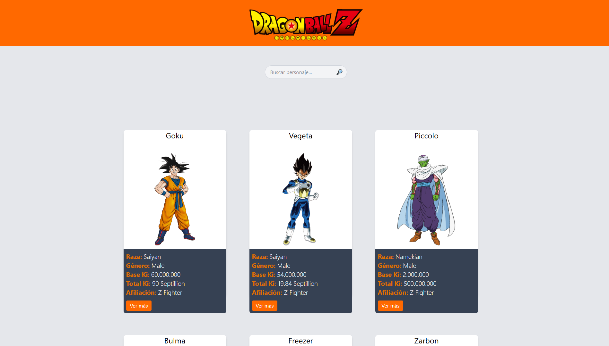
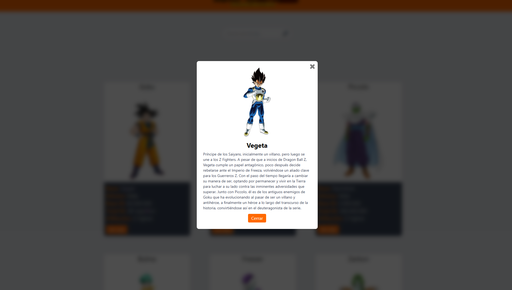

# 🐉 Dragon Ball Characters App

Aplicación web desarrollada con **React + TypeScript + Tailwind CSS** que consume una API pública de Dragon Ball para mostrar personajes con información detallada.

---

## 🚀 Demo

👉 https://germanpgonzalez.github.io/dragonballapp/

---

## 📸 Screenshots

<!-- Agregá acá tus imágenes -->




---

## ✨ Features

* 📋 Listado de personajes
* 🔄 Paginación
* 🔍 Búsqueda de personajes (por página)
* ⏳ Loader de carga
* 🐉 Efectos visuales según la raza (hover glow)
* 🖼️ Lazy loading de imágenes
* 📄 Modal con información detallada del personaje
* ⚠️ Estado vacío cuando no hay resultados

---

## 🛠️ Tech Stack

* ⚛️ React
* 🟦 TypeScript
* ⚡ Vite
* 🎨 Tailwind CSS

---

## 🌐 API

https://web.dragonball-api.com/

---

## 📦 Instalación

Clonar el repositorio:

```bash
git clone https://github.com/germanpgonzalez/dragonballapp.git
```

Instalar dependencias:

```bash
npm install
```

Ejecutar en desarrollo:

```bash
npm run dev
```

---

## 🧠 Aprendizajes

En este proyecto trabajé en:

* Consumo de APIs
* Manejo de estado con React
* Tipado con TypeScript
* Renderizado dinámico de listas
* Manejo de eventos y props
* Diseño de UI con Tailwind
* Implementación de funcionalidades reales como búsqueda, paginación y modales

---
